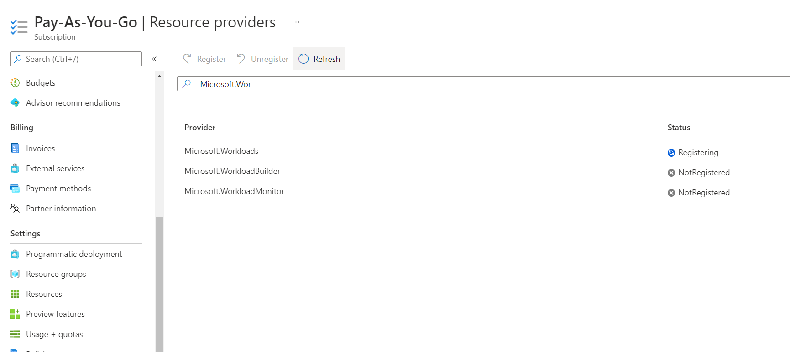
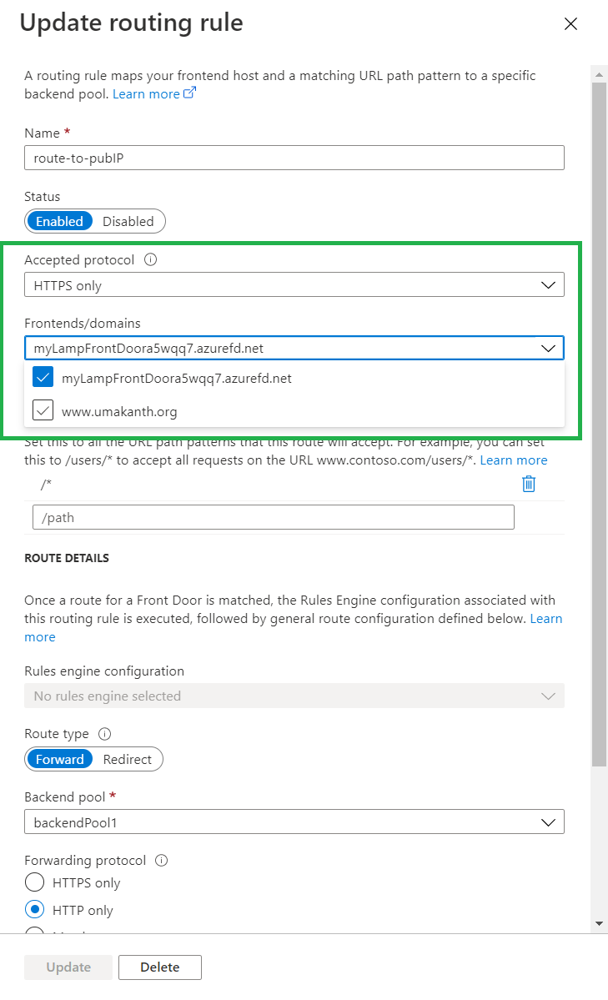

<h3 align="center">Getting Started with Scalable WordPress on Azure</h3>

  <p align="left">
    This guide will help you get started with the Private Preview for the scalable WordPress on Azure. Once deployed, there are optional steps you can take to customize your post-deployment experience.
  </p>
   <p align="center">
  <br/>
    <a href="https://aka.ms/SWPPreview">Signup for Private Preview Access</a>
    ·
    <a href="https://aka.ms/SWPFeedback">Share feedback</a>
  </p>
</div>


<!-- TABLE OF CONTENTS -->
<details>
  <summary>Table of Contents</summary>
  <ol>
    <li>
      <a href="#about-the-project">About Scalable WordPress on Azure</a>
    </li>
    <li>
      <a href="#getting-started">Getting Started</a>
      <ul>
                <li><a href="#registration">Registering the Resource Provider</a></li>
      </ul>
    </li>
    <li>
      <a href="#deployment">Deployment</a>
    </li>  
    <li>
      <a href="#post-deployment">Post Deployment</a>
      <ul>
        <li><a href="#wordpress-endpoint">WordPress end-point and other essentials</a></li>
        <li><a href="#wordpress-creds">WordPress admin credentials</a></li>
        <li><a href="#custom-domain">Configuring a custom domain</a></li>
      </ul>
    </li>
    <li><a href="#open-issues">Open Issues</a></li>
    <li><a href="#faqs">Frequently asked questions</a></li>
    <li><a href="#roadmap">Roadmap</a></li>
    <li><a href="#contact">Contact</a></li>
  </ol>
</details>


<!-- ABOUT THE PROJECT -->
## <a name="about-the-project"></a>About Scalable WordPress on Azure


This is a new capability from Azure simplifying the deployment of scalable WordPress solutions. Simply select a deployment size based on your planned scale and we will take care of Azure infrastructure defaults on your behalf. All deployment sizes come with an optimized WordPress application working out of the box. You have four pre-defined sizes to choose from:


| Deployment Size | Description |
| --- | --- |
| Small  | This option gives you a modest sized but faster deployment (25-30mins). This is best for dev/test scenarios that don't have high scale requirements. The web node is a 2 core, 4GiB RAM VM with MySQL running on a Burstable SKU with 1 core and 64 GB storage.
| Medium | This is best for applications that experience steady traffic. The web node is a 4 core, 8GiB RAM VM with MySQL running on a General Purpose SKU with 2 cores and 256 GB storage.
|Large | This option is best for applications that benefit from increased performance. The web node is a 16 core, 32GiB RAM VM with MySQL running on a General Purpose SKU with 16 cores and 512 GB storage.
| Extra Large | This is best for applications that may experience unpredictable growth. The web node is a 16 core, 32GiB RAM VM with MySQL running on a General Purpose SKU with 32 cores and 1024 GB storage.

<p align="right">(<a href="#top">back to top</a>)</p>


<!-- GETTING STARTED -->
## <a name="getting-started"></a>Getting Started

The first thing you'll need to do is to request your Azure subscription <a href="https://aka.ms/SWPPreview">be allowed</a> to access this capability. If your Azure subscription has already been approved to access this functionality, there's one more step you need to complete (inside the Azure Portal) before being able to kick off deployments.

### <a name="registration"></a>Registering the Resource Provider

1. You'll need to locate the subscription inside Azure that you've been allow listed for and access the Subscription page for that particular subscription. Once you're on that page, locate the "Resource providers" on the lower left pane.

    

2. Clicking on the "Resource providers" entry will take you to a list of resources where you'll need to filter on "Microsoft.Workloads" in the search bar. Once you narrow this list down, you should see an entry for "Microsoft.Workloads" whose status will read as "NotRegistered". With this entry selected, click on "Register" above the search to register this specific resource provider. 

    

   This should take a few minutes to complete.

    

3. Once this step is complete, you're ready to head over to <a href="https://aka.ms/wordpress-on-linux">deploy your scalable WordPress application</a> or look at your current deployments if you've deployed WordPress successfully at least once. On the same screen, you can also search for WordPress in the search bar to get the deployment capability as a search result.

    

### <a name="deployment"></a>Deployment

Once you're  on the deployment screen, you should be able to kick off a deployment by selecting a "Deployment size" with most of the other fields having been auto-populated. Selecting a deployment size results in Azure infrastructure defaults being assigned based on the selected size. You're free to edit both the pre-populated fields on the Basics screen as well as head over to the "Advanced" tab to optionally tweak infrastructure options.

  


## <a name="post-deployment"></a>Post-Deployment

The deployment takes anywhere between ~25mins (Small) and an hour (Extra large) depending on the size of deployment chosen. Please note that these deployment times are mentioned as a guideline for the default Azure infrastructure options for each of the deployment sizes. In addition, once you kick off a deployment, you can walk away and let the deployment complete. 

### <a name="wordpress-endpoint"></a>Accessing the WordPress application end-point

From the same location that you've used to kickoff a WordPress deployment, you will be able to locate the list of past deployments, if any exist. Clicking on any of these deployments will result in a deployment specific view that among other things, displays the following key information:

 - Domain name / application end-point
 - Deployment status
 - The infrastructure resource group containing underlying Azure resources

  

### <a name="wordpress-creds"></a>Getting WordPress admin credentials

1. The default administrator username for your WordPress deployment is "admin". As of today, there are a few extra steps to locate the administrator password. You'll need to locate your WordPress deployment and locate the Overview->Essentials section for said deployment. Once you do that, you'll need to click on your Infrastructure resource group to access your underlying Azure infrastructure:

    

2. Once you click into the Azure Infrastructure group, you will see a list of underlying Azure resources that power your deployment. You'll need to locate an Azure resource with the name "controller-vm". This virtual machine is a jumpbox instance that you can use to locate your WordPress admin credentials. In addition, this virtual machine provides administrative options to manage your WordPress deployment from the command-line (in addition to using the WordPress admin interface from your web browser).

    

3. Click on the controller-vm instance to get to the essentials section for the controller-vm instance. Here's where you'll locate the public IPv4 address that you'll use to SSH into the controller-vm:
  
    
  
4. Once you have the IPv4 address handy, [locate an SSH client and your local SSH private keys](https://docs.microsoft.com/en-us/azure/virtual-machines/ssh-keys-portal#connect-to-the-vm) to securely login to the controller virtual machine. The default username for these deployments is "azureuser" unless you've customized it to some other value at deployment time. With this information, you can now remotely connect to the controller virtual machine:

  ```
  ssh -i <path to the .pem file if applicable> azureuser@vmcontroller-publicIP 
  ```

5. Once you're logged into the controller virtual machine, you can surface the randomly generated WordPress admin password:

  ```   
  cat /tmp/vars.txt | grep -A1 'WordPress' | tail -1
  ```

  The string that you see on your command line output is your WordPress administrator password.
      

  You should be now able to access your WordPress portal with the obtained credentials. 


### <a name="custom-domain"></a>Configuring a custom domain

1. If you have a custom domain parked at a domain registrar, these steps will guide you configure your custom domain to point to your WordPress deployment. Please note we do not yet support the ability to register custom domains. You'll need to locate your deployment from the list of your current deployments and navigate to the underlying Azure infrastructure resource group from the "Essentials" area.

    

2. Within this Azure infrastructure resource group is an Azure FrontDoor resource that you'll need to locate to begin the process of adding your custom domain name to your deployment:

    

3. Once you've located the Overview section, click on the "Front Door designer" option under Settings to bring up the "Frontends/domains". Click on the banner as seen below to bring up the custom domain addition panel.
    

4. Please note that Azure Front Door does not support addition of root domains unless you're using Azure DNS. What this means is the custom domain that you're about to configure will need "www" in the domain URL. Attempting to add a custom domain will have the interface prompting you to configure your CNAME record for your custom domain

    

5. For the next step, you'll have to leave Azure and configure your custom domain by editing the CNAME entry for your custom domain. 

    

6. At this point, you'll need to return to the Front Door designer inside Azure and attempt to add the custom domain again:

    

7. Once this step is done, what's left is to enable each of the two routing rules for the newly added custom domain. 

   *HTTPS to HTTP Redirect:*
    
    
   
   *Route to Load Balancer:*
   
    

8. At this point, you'll need to click "Save" on the upper top left banner and wait for DNS changes to propagate. This could take any where between 5 and 15 minutes. 

    

<p align="right">(<a href="#top">back to top</a>)</p>

## <a name="open-issues"></a>Open Issues
### Deployment Failures
1. You may see a rare deployment failure with an error that reads "Internal Server Error" around the deployment of a MySQL database. This is being tracked internally and a fix is on the way. The workaround is to delete the partial/failed deployment and try kicking off your deployment again.

2. You may also see another deployment failure again with the MySQL Database provisioning. This is an artifact of an extremely rare but possible timing condition and a patch for this issue is in testing and expected to go live on around 14th of March 2022. The workaround is to try kicking off another deployment and delete your incomplete deployment. 

3. You may see a partial deployment where WordPress doesn't get deployed and you'll end up seeing an Nginx page. The issue here is with automation around apt-key usage and gpg. We're working on making this part more robust. For now, the workaround will be to delete your partial deployment and start over.

### Infrastructure capabilities
1. Azure Cache for Redis was removed as a caching option as some more work is needed for seamless integration with popular WordPress plugins and having this functionality working out of the box. This functionality is expected shortly after the private preview go live.
2. Azure Monitoring for deployed infrastructure isn't available out of the box and needs to be manually configured by customers post-deployment. We're working on simplifying and coming up with a out-of-the-box solution for monitoring your WordPress deployments.

### Fit and finish
1. A partial or failed deployment will show up in the list of your WordPress deployments and you will have to click into the deployment to confirm deployment status for each deployment.


## <a name="faqs"></a>Frequently Asked Questions

**Q: What's the need for this capability? What can I do now that I haven't been able to do previously?**

**A:** The approach is to make it simple for customers to deploy a scalable infrastructure with a few clicks and get going fast and have an optimized solution out of the box.


**Q: Is there a reason why I shouldn't move my WordPress deployments across subscriptions or resource groups?**

**A:** We're not restricting the move of deployments across subscriptions and resource groups at this point. Given that subscriptions need to be allow-listed for functionality access, we do not recommend moving across subscriptions. While you can still move deployments across resource groups, this isn't currently recommended from a workload tracking and management perspective.

**Q: Why do I have to SSH into a virtual machine?**

**A:** While you can use the "controller virtual machine" for a host of administration tasks and to take a "better look under the hood" for a greater degree of control, the reason for asking for an SSH is to retrieve your WordPress administrator credentials. We're working on how to better surface this information without needing to SSH at all.

**Q: Is it possible to deploy an application other than WordPress?**

**A:** Depending on customer feedback, we'll be able to expand this capability to other PHP applications such as Moodle, Drupal or Magento or even non PHP Linux applications, moving forward.


**Q: Is deployment of Windows applications supported?**

**A:** At this point, we're targeting simplification of scalable Linux applications and have no plans for deploying any Windows applications.

**Q: How do I completely delete my WordPress deployment?**

**A:** You should be able to select a deployment from the list of your WordPress deployments and select the delete option to completely remove your WordPress deployment.

<!-- ROADMAP -->
## <a name="roadmap"></a>Roadmap

- [ ] Addition of Azure Cache for Redis as a caching option
- [ ] Azure Monitoring integration working out of the box
- [ ] Integration with Application Gateway (L7 Load Balancer)
- [ ] Load testing (JMeter) integrated with deployments
 


<!-- CONTACT -->
## <a name="contact"></a>Contact

Umakanth Puppala - umpu@microsoft.com
Venu Sivanadam - veshivan@microsoft.com

<p align="right">(<a href="#top">back to top</a>)</p>